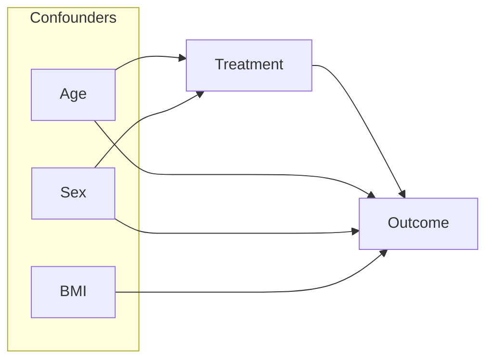

# Integrated supporting reference: medical_research_architect/resources/templates/SAP_protocol.md

> Embedded source: `embedded-source/medical_research_architect/resources/templates/SAP_protocol.md`
> This file is part of the single `deepseek-sci` skill. Apply the parent Python-only and provenance rules.

# Statistical Analysis Plan (SAP)

> **Standard**: This document outlines the complete statistical methodology for the research project, ensuring reproducibility and rigor.

## 1. Document Control

| Property | Value |
| :--- | :--- |
| **Project Title** | `[From PICO_definition.md]` |
| **SAP Version** | 1.0 |
| **Date** | `[DATE]` |
| **Statistician** | Antigravity AI |

---

## 2. Study Design Overview

| Property | Value |
| :--- | :--- |
| **Design Type** | `[e.g., Retrospective Cohort / RCT / Case-Control]` |
| **Data Source** | `[e.g., Hospital EHR, Public Dataset, Clinical Trial Registry]` |
| **Study Period** | `[e.g., January 2020 - December 2024]` |

### Sample Size Justification
| Parameter | Value |
| :--- | :--- |
| **Method** | `[e.g., Power Analysis (G*Power) / SSAML (for ML)]` |
| **Alpha (α)** | `0.05` |
| **Power (1-β)** | `0.80` |
| **Effect Size** | `[e.g., Cohen's d = 0.5 (Medium)]` |
| **Calculated Sample Size (N)** | `[e.g., 128 per group]` |
| **Accounting for Dropout (e.g., 10%)** | `[e.g., Target N = 142 per group]` |

---

## 3. Variable Definitions

| Type | Variable Name | Definition / Unit | Role | Data Type |
| :--- | :--- | :--- | :--- | :--- |
| **Dependent (Y)** | `[e.g., HbA1c_Change]` | Change in HbA1c (%) from baseline | Primary Outcome | Continuous |
| **Independent (X)** | `[e.g., Treatment_Group]` | Intervention vs. Control | Exposure | Categorical (Binary) |
| **Covariate** | `[e.g., Age]` | Age at enrollment (years) | Confounder | Continuous |
| **Covariate** | `[e.g., Sex]` | Biological sex (Male/Female) | Confounder | Categorical (Binary) |
| **Covariate** | `[e.g., BMI]` | Body Mass Index (kg/m²) | Confounder | Continuous |
| **Covariate** | `[e.g., Baseline_HbA1c]` | HbA1c at baseline (%) | Confounder | Continuous |

---

## 4. Statistical Methods

### 4.1 Descriptive Statistics
-   **Continuous Variables (Normal Distribution)**: Mean ± Standard Deviation (SD)
-   **Continuous Variables (Skewed Distribution)**: Median (Interquartile Range, IQR)
-   **Categorical Variables**: N (%)

### 4.2 Assumption Checks
| Assumption | Test | Decision Rule |
| :--- | :--- | :--- |
| Normality | Shapiro-Wilk Test | p > 0.05 → Normal |
| Homogeneity of Variance | Levene's Test | p > 0.05 → Equal Variance |

### 4.3 Primary Analysis (Hypothesis Testing)
| Comparison | Test | Justification |
| :--- | :--- | :--- |
| Continuous Y, 2 Groups (Normal) | Independent t-test | Comparing means |
| Continuous Y, 2 Groups (Non-Normal) | Mann-Whitney U Test | Comparing medians |
| Continuous Y, >2 Groups (Normal) | One-Way ANOVA | Comparing means across groups |
| Categorical Y, Categorical X | Chi-Square Test / Fisher's Exact | Comparing proportions |

### 4.4 Multivariable Analysis
-   **Model Type**: `[e.g., Multiple Linear Regression / Logistic Regression / Cox Proportional Hazards]`
-   **Covariates to Adjust**: `[List from Section 3]`
-   **Model Selection**: `[e.g., Stepwise / LASSO / Clinical Expertise]`

### 4.5 Causal Inference Methods (If Observational)

> [!NOTE]
> This section applies ONLY to observational studies requiring confounder adjustment.

#### Directed Acyclic Graph (DAG)

-   **DAG Validated?**: `[ ] Yes / [ ] No`

#### Method Selection
-   [ ] **Propensity Score Matching (PSM)**: 1:1 nearest-neighbor matching, caliper = 0.2 SD of logit of PS.
-   [ ] **Inverse Probability of Treatment Weighting (IPTW)**: Stabilized weights, truncated at 1st/99th percentile.

### 4.6 Machine Learning (If Applicable)
| Parameter | Value |
| :--- | :--- |
| **Algorithm** | `[e.g., Random Forest / XGBoost / LASSO]` |
| **Validation Strategy** | `[e.g., 5-Fold Cross-Validation / Train-Test Split (80/20)]` |
| **Hyperparameter Tuning** | `[e.g., Grid Search / Bayesian Optimization]` |
| **Performance Metrics** | `[e.g., AUC-ROC, Sensitivity, Specificity, F1-Score]` |
| **Sample Size (SSAML Check)** | `[ ] Adequate / [ ] Needs Augmentation` |

---

## 5. Missing Data Handling

| Strategy | Description |
| :--- | :--- |
| **Complete Case Analysis** | Exclude all records with any missing values. |
| **Multiple Imputation (MI)** | Use `mice` package in R. M = 5 imputations. |
| **Sensitivity Analysis** | Compare results from Complete Case vs. MI. |

---

## 6. Significance & Reporting

| Parameter | Value |
| :--- | :--- |
| **Alpha Level (Significance Threshold)** | `0.05` (Two-tailed) |
| **Confidence Interval** | `95%` |
| **Multiple Comparison Correction** | `[e.g., Bonferroni / FDR (Benjamini-Hochberg)]` |

---

## 7. Visualization Plan ("Nano Banana Pro" Specs)

### Figure List
| Fig # | Type | Description |
| :--- | :--- | :--- |
| 1 | Flowchart (Mermaid) | Study participant flow (CONSORT/STROBE) |
| 2 | Bar/Violin Plot | Baseline characteristics comparison |
| 3 | Box/Forest Plot | Primary outcome comparison / Regression coefficients |
| 4 | Kaplan-Meier Curve | Time-to-event analysis (if applicable) |

### Aesthetic Requirements
| Property | Specification |
| :--- | :--- |
| **Resolution** | 600 DPI |
| **Font** | Arial |
| **Color Palette** | Color-blind friendly (e.g., Viridis, Okabe-Ito) |
| **File Format** | PNG (for draft), TIFF (for final submission) |

---

## 8. Approval Gate

### Agent's Pre-Submission Check:
-   [ ] SAP Protocol is complete and internally consistent.
-   [ ] All statistical tests are appropriate for the data types.
-   [ ] Assumption checks are defined.
-   [ ] Visualization plan meets publication standards.

### User/Expert Action Required:
-   `[ ]` **SAP_ACCEPT**: Approve the SAP and authorize script generation/execution.
-   `[ ]` **SAP_REVISE**: Request methodological revisions.

