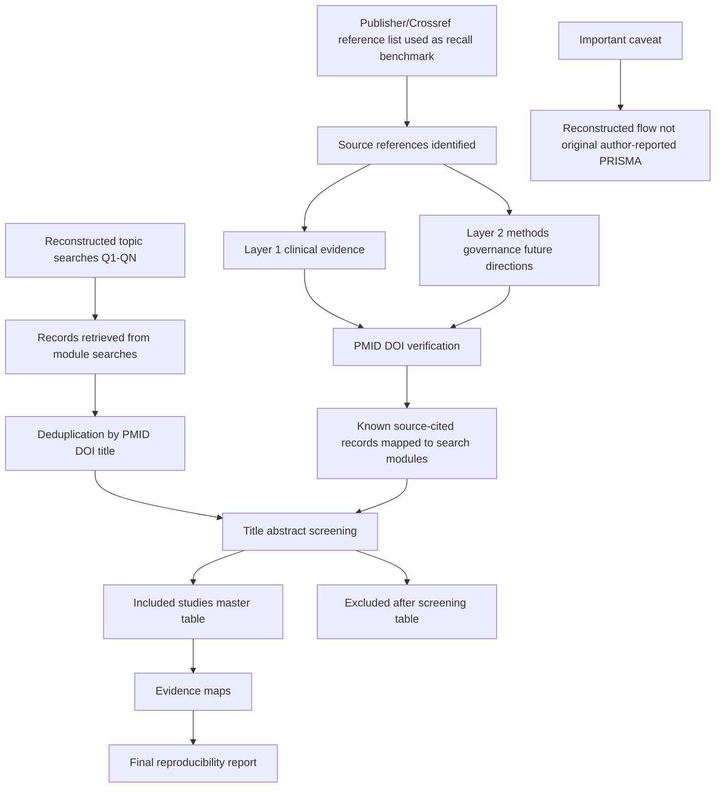

# Integrated supporting reference: narrative-review-replication/templates.md

> Embedded source: `embedded-source/narrative-review-replication/templates.md`
> This file is part of the single `deepseek-sci` skill. Apply the parent Python-only and provenance rules.

# Templates for Narrative Review Replication and New Research Launch

## research_brief.md skeleton

```markdown
# Research brief

## Working title

## Clinical domain

## Initial problem statement

## Intended product

## Target journal or use case

## Available data/literature resources

## Timeline

## Key constraints

## Initial decision
```

## seed_literature_list.csv fields

```csv
seed_id,title,year,journal,doi,pmid,item_key_if_zotero,why_seed,role
```

## included_studies_master.csv fields

```csv
ref_no,layer,domain,study,year,journal,doi,pmid_or_status,lifecycle_category,search_module,included_reason
```

## topic_search_recall_matrix.csv fields

```csv
pmid,study,ref_no,category,recovered_by_topic_module,notes
```

## excluded_after_screening.csv fields

```csv
source_query,record_type,example_or_rule,exclusion_reason,decision
```

## verified_primary_study_metrics.csv fields

```csv
study,pmid,doi,use_case,dataset_or_sample,model,validation_type,reported_metrics,external_validation,clinical_comparator,source_of_metric,needs_fulltext_verification,notes
```

## replication_scorecard.csv fields

```csv
module,weight,status,score,notes
```

## research_gap_map.csv fields

```csv
gap_id,gap_type,evidence_source,what_is_known,what_is_missing,why_it_matters,possible_research_question,feasibility,novelty,clinical_impact,priority
```

## opportunity_matrix.csv fields

```csv
opportunity_id,title,research_type,PICO_or_PCC,core_argument,required_data,key_methods,novelty,clinical_impact,feasibility,risk,target_journals,priority
```

## immediate_next_actions.md skeleton

```markdown
# Immediate next actions

## Today

- [ ] Action 1
- [ ] Action 2
- [ ] Action 3

## This week

- [ ] Literature search and screening
- [ ] Evidence matrix construction
- [ ] Protocol/proposal draft

## This month

- [ ] Complete evidence map or analysis dataset
- [ ] Draft manuscript outline
- [ ] Prepare target journal package

## Decision points

## Stop/go criteria
```

## manuscript_proposal.md skeleton

```markdown
# Manuscript proposal

## Proposed title

## Article type

## Rationale

## Knowledge gap

## Novelty statement

## Aim and scope

## PICO/PCC

## Search strategy or data source

## Proposed manuscript outline

## Figure plan

## Table plan

## Expected contribution

## Risks and mitigation

## Target journals

## Writing timeline
```

## Mermaid reconstructed search-flow template



## Final report skeleton

```markdown
# Final reproducibility report

## Target article

## Review type judgment

## What was reproduced

### Article architecture
### Lifecycle taxonomy
### Clinical evidence base
### Methods/governance evidence base
### Topic-search reconstruction

## Search reproducibility

## Recall/precision status

## Inclusion and exclusion criteria

## Main outputs

## Reproducibility score

## What cannot be fully reproduced

## Remaining work

## Final conclusion
```

